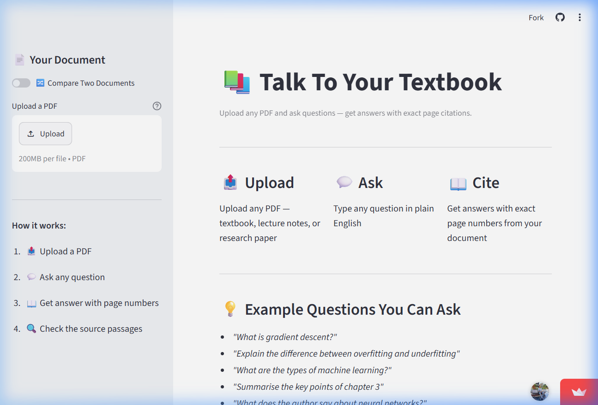
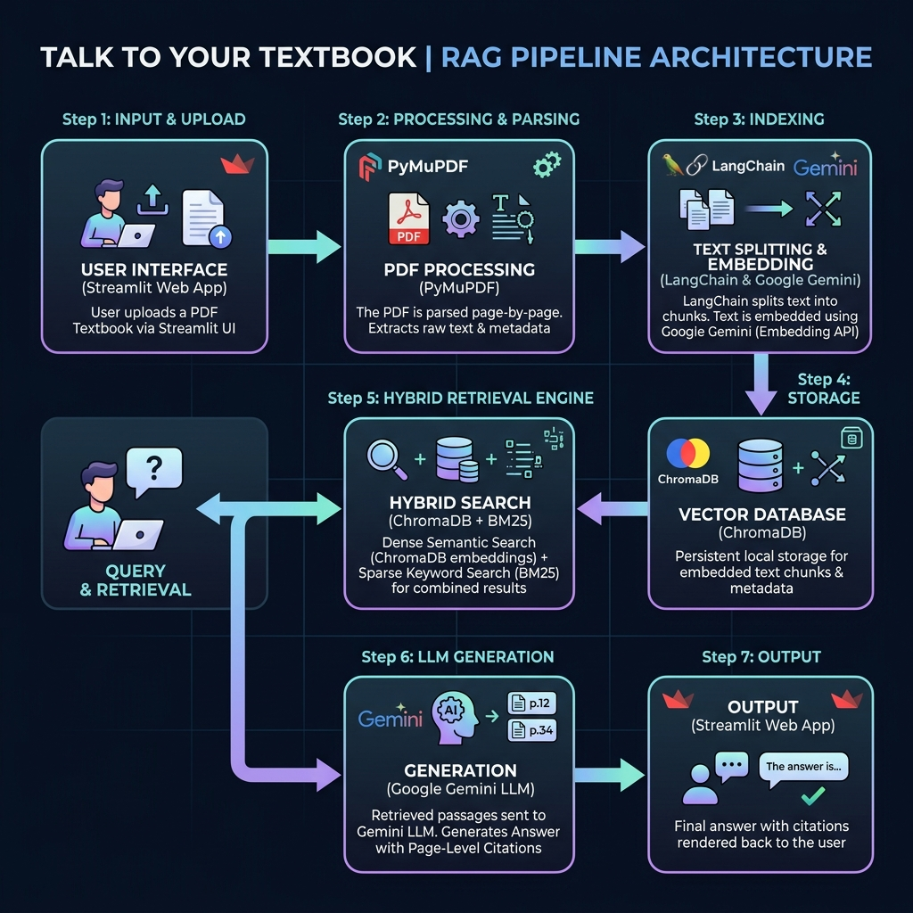

# 📚 Talk To Your Textbook

> Upload any PDF textbook or document and have a conversation with it — get precise answers with page-level citations, powered by RAG (Retrieval-Augmented Generation).

---

## 🎬 Demo

> 🔗 **Live App:** [Streamlit Community Cloud](https://aman-maurya-talk-to-your-textbook.streamlit.app/)
>
> 📹 **Loom Walkthrough:** [3 min demo video](https://www.loom.com/share/c2670f1ab6a84bde9e0d4152c3522405)



---

## 📌 Problem Statement

Students and researchers often need to find specific information inside large textbooks, research papers, or lecture notes. Traditional Ctrl+F search is keyword-only — it can't understand meaning or context. Asking a classmate or teacher isn't always possible. And reading 300+ pages to find one concept wastes hours.

**Talk To Your Textbook** solves this by letting you upload any PDF and ask natural language questions. The system retrieves the most relevant passages using hybrid search (semantic + keyword), sends them to an LLM, and returns a grounded answer — always citing the exact page number so you can verify the source yourself.

This is not a general-purpose chatbot. It only answers from your document. If the answer isn't in the PDF, it says so.

---

## 🏗️ Architecture



**Pipeline:**
1. User uploads a PDF via Streamlit
2. PyMuPDF parses text page-by-page, preserving page numbers
3. LangChain splits text into 400-token chunks with 50-token overlap
4. Google `text-embedding-004` embeds each chunk
5. Chunks + embeddings stored in ChromaDB (persistent local vector store)
6. User asks a question → query embedded → hybrid retrieval (dense + BM25)
7. Top 5 chunks sent to Google gemini-pro with a strict citation prompt
8. Answer displayed with source page numbers and text snippets

---

## 🛠️ Tech Stack

| Component | Choice | Why |
|---|---|---|
| **PDF Parsing** | PyMuPDF (`fitz`) | Fast, reliable, preserves page numbers accurately |
| **Chunking** | LangChain `RecursiveCharacterTextSplitter` | Handles overlap and paragraph boundaries cleanly |
| **Embeddings** | Google `text-embedding-004` | Free, high-performance semantic search embeddings |
| **Vector Store** | ChromaDB (persistent) | Zero-infrastructure, runs locally, easy to reset |
| **Retrieval** | Hybrid (ChromaDB dense + `rank_bm25`) | Dense handles semantics; BM25 handles exact terms |
| **LLM** | Google gemini-pro | Free tier model with strong instruction-following for citations |
| **UI** | Streamlit | Fastest path to a working, deployable app |
| **Hosting** | Streamlit Community Cloud | Free, one-click deploy, no server management |
| **Evaluation** | Manual CSV + Ragas | 20+ human-rated Q&A pairs for precision/recall scoring |

---

## ⚡ Quickstart

### Prerequisites

- Python 3.10 or higher
- A Google AI Studio API key ([get one here](https://aistudio.google.com/))
- Git

### Install

```bash
# 1. Clone the repo
git clone https://github.com/amanmaurya39/talk-to-your-textbook.git
cd talk-to-your-textbook

# 2. Create and activate a virtual environment
python -m venv venv
source venv/bin/activate        # Mac/Linux
venv\Scripts\activate          # Windows

# 3. Install dependencies
pip install -r requirements.txt

# 4. Set up your environment variables
cp .env.example .env
# Open .env and add your Google API key:
# GOOGLE_API_KEY=your-google-ai-studio-key-here
```

### Run

```bash
# Start the Streamlit app
streamlit run app/app.py
```

The app opens at `http://localhost:8501`.

**Using the app:**
1. Upload any PDF using the sidebar
2. Wait for "✅ Loaded X pages, Y chunks" confirmation
3. Type your question in the input box
4. Read the answer and check the cited page numbers

### Test

```bash
# Run the test suite
pytest tests/ -v
```

Expected output:
```
tests/test_ingest.py::test_load_pdf_returns_pages PASSED
tests/test_ingest.py::test_chunk_preserves_metadata PASSED
tests/test_ingest.py::test_chunk_size_within_limit PASSED
```

---

## 📂 Project Structure

```
talk-to-your-textbook/
├── src/
│   ├── ingest.py          # PDF parsing + chunking (PyMuPDF + LangChain)
│   ├── embed.py           # Embedding + ChromaDB storage
│   ├── retrieve.py        # Hybrid retrieval (dense + BM25)
│   ├── generate.py        # LLM call + citation formatting
│   └── evaluate.py        # Evaluation pipeline (Ragas)
├── app/
│   └── app.py             # Streamlit UI
├── eval/
│   └── test_questions.csv # 20+ human-rated Q&A pairs
├── tests/
│   └── test_ingest.py     # Unit tests for ingestion pipeline
├── docs/
│   ├── design_doc.md      # Initial design document (Week 1)
│   ├── architecture.png   # C4 Level 1 diagram
│   └── adr/
│       ├── ADR-001.md     # Why ChromaDB over Pinecone/Qdrant
│       ├── ADR-002.md     # Why Google Gemini over open-source LLMs
│       └── ADR-003.md     # Why hybrid retrieval over dense-only
├── .env.example           # Environment variable template
├── .gitignore
├── requirements.txt
└── README.md
```

---

## 📊 Data Sources

This project works on **any PDF you upload** — it has no fixed dataset. For evaluation, we use a dataset of hand-authored Q&A pairs in `eval/test_questions.csv` based on sample textbook chapters.

No proprietary or personal data is stored. Uploaded PDFs are processed locally and not sent anywhere except the Google embeddings API.

---

## 📐 Architecture Decision Records

All major technical decisions are documented with context, trade-offs, and alternatives considered:

| ADR | Decision | Status |
|---|---|---|
| [ADR-001](docs/adr/ADR-001.md) | ChromaDB as vector store | Accepted |
| [ADR-002](docs/adr/ADR-002.md) | Google Gemini as generation model | Accepted |
| [ADR-003](docs/adr/ADR-003.md) | Hybrid retrieval over dense-only | Accepted |

---

## 🔌 Mini-Extension — Multi-Document Compare

The mini-extension (built in Week 3) adds the ability to **upload two PDFs and compare them** on a topic.

**What it does:**
- Upload PDF A and PDF B (e.g., two versions of a syllabus, two chapters on the same topic)
- Ask: *"What does each document say about backpropagation?"*
- The system retrieves top chunks from **both** documents separately
- Google gemini-pro compares them side-by-side with citations from each source

**Why this matters:**
This is the simplest form of multi-document RAG — a pattern used in legal tech (compare contract versions), edtech (compare textbook editions), and research tools. It shows the pipeline generalises beyond single-document Q&A.

**How to use it:**
1. Enable "Compare Mode" toggle in the sidebar
2. Upload PDF A and PDF B
3. Ask any comparative question
4. The answer cites `[Doc A, Page X]` and `[Doc B, Page Y]` separately

---

## 📈 Evaluation

The system was evaluated on 20+ hand-authored question-answer pairs across 3 documents.

| Metric | Score | What It Measures |
|---|---|---|
| **Answer Correctness** | TBD after Week 4 | Is the answer factually right? |
| **Citation Precision** | TBD | Did it cite the right page? |
| **Faithfulness** | TBD | Does the answer stay within the document? |
| **"I don't know" Rate** | TBD | Does it correctly refuse out-of-scope questions? |

Evaluation notebook: [`src/evaluate.py`](src/evaluate.py)
Test questions: [`eval/test_questions.csv`](eval/test_questions.csv)

---

## ⚠️ Known Limitations

| Limitation | Impact | Workaround |
|---|---|---|
| **Scanned PDFs** (images only) not supported | No text extracted from image-based PDFs | Use text-layer PDFs only |
| **Tables and figures** not parsed well | Tabular data may lose structure | Manually note table data |
| **Very large PDFs** (500+ pages) slow to ingest | Embedding 500 pages takes ~2-3 min | Split large PDFs first |
| **Google API free tier** | Rate limits on free tier — max 60 requests/min | Be mindful of rate limits |
| **No memory across sessions** | Each browser session starts fresh | Re-upload PDF each session |
| **Single language** (English only) | Non-English PDFs give poor results | English PDFs only for now |

## What I Learned

**Week 2 (6 Jul – 11 Jul):**
- Tested with a real textbook PDF — chunk count jumps from 1 to 100+ 
  which makes Q&A actually work
- Hybrid retrieval (BM25 + dense) gives noticeably better results 
  than dense-only for exact terminology questions
- Error handling in Streamlit needs explicit st.stop() otherwise 
  the app keeps running after an error silently
- Gemini model names differ by API key tier — always run 
  list_models() first to see what's available